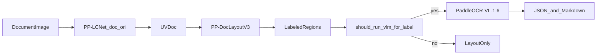

# PP-DocLayoutV3 layout labels and recognition models

PP-DocLayoutV3 emits **one class label per detected region**. docparser does **not** load a separate Hugging Face model per label; it uses **PaddleOCR-VL-1.6** with task-specific prompts after layout. This page lists labels, docparser routing, and which HF models Paddle uses on other pipelines.

## Architecture in docparser



| Stage | HF artifact | Local path |
|-------|-------------|------------|
| Doc orientation | [PP-LCNet_x1_0_doc_ori_safetensors](https://huggingface.co/PaddlePaddle/PP-LCNet_x1_0_doc_ori_safetensors) | `models/PP-LCNet_x1_0_doc_ori/` |
| Doc unwarping | [UVDoc_safetensors](https://huggingface.co/PaddlePaddle/UVDoc_safetensors) | `models/UVDoc/` |
| Layout | [PP-DocLayoutV3_safetensors](https://huggingface.co/PaddlePaddle/PP-DocLayoutV3_safetensors) | `models/PP-DocLayoutV3/` |
| Recognition | [PaddleOCR-VL-1.6](https://huggingface.co/PaddlePaddle/PaddleOCR-VL-1.6) | `models/PaddleOCR-VL-1.6/` |

## Canonical labels (25 classes)

From `models/PP-DocLayoutV3/config.json` (mirrored in `crates/pp-doclayout-v3/tests/fixtures/config.json`):

| ID | Label | ID | Label |
|----|-------|----|-------|
| 0 | `abstract` | 13 | `header_image` |
| 1 | `algorithm` | 14 | `image` |
| 2 | `aside_text` | 15 | `inline_formula` |
| 3 | `chart` | 16 | `number` |
| 4 | `content` | 17 | `paragraph_title` |
| 5 | `formula` | 18 | `reference` |
| 6 | `doc_title` | 19 | `reference_content` |
| 7 | `figure_title` | 20 | `seal` |
| 8 | `footer` | 21 | `table` |
| 9 | `footer_image` | 22 | `text` |
| 10 | `footnote` | 23 | `text_block` |
| 11 | `formula_number` | 24 | `vision_footnote` |
| 12 | `header` | | |

**Naming:** Official Paddle [inference.yml](https://huggingface.co/PaddlePaddle/PP-DocLayoutV3/blob/main/inference.yml) uses `display_formula` and `vertical_text` instead of `formula` / `text_block`. `task_for_layout_label` accepts `display_formula` as an alias for formula recognition.

## docparser routing (default pipeline)

Logic in `crates/paddleocr-vl/src/lib.rs` (`task_for_layout_label`, `should_run_vlm_for_label`).

| Label group | `VlmTask` | Prompt prefix | VLM runs? |
|-------------|-----------|---------------|-----------|
| Text-like: `abstract`, `algorithm`, `content`, `doc_title`, `paragraph_title`, `reference`, `reference_content`, `figure_title`, `text`, `text_block`, `vision_footnote`, `footnote`, `number`, `formula_number`, `header`, `footer`, `aside_text`, `vertical_text` | `Ocr` | `OCR:` | Yes |
| `table` | `Table` | `Table Recognition:` | Yes |
| `formula`, `display_formula`, `inline_formula` | `Formula` | `Formula Recognition:` | Yes |
| `chart` | `Chart` | `Chart Recognition:` | Only if `use_chart_recognition` |
| `seal` | `Seal` | `Seal Recognition:` | Only if `use_seal_recognition` |
| `image`, `header_image`, `footer_image` | `Ocr` | `OCR:` | Only if `use_ocr_for_image_block` |

Official defaults set `use_chart_recognition`, `use_seal_recognition`, and `use_ocr_for_image_block` to **false** (same as PaddleX).

### Markdown output

Labels omitted from assembled Markdown (`official_markdown_ignore_labels`):

```text
number, footnote, header, header_image, footer, footer_image, aside_text
```

Doc orientation and unwarping run before layout when enabled (default). Opt out: `USE_DOC_ORIENTATION_CLASSIFY=false`, `USE_DOC_UNWARPING=false`.

### Per-class box merge

| Merge mode | Labels |
|------------|--------|
| `large` | `chart`, `formula`, `display_formula`, `doc_title`, `inline_formula`, `paragraph_title` |
| `union` | all others |

See [paddleocr_model_alignment.md](paddleocr_model_alignment.md).

## PaddleOCR-VL recognition (what docparser uses)

All content recognition goes through **one VLM** with different prompts — not separate HF repos per label.

| Region type | HF model | VLM task |
|-------------|----------|----------|
| General text | PaddleOCR-VL-1.6 | `ocr` |
| Table | same | `table` |
| Formula | same | `formula` |
| Chart | same | `chart` (optional) |
| Seal | same | `seal` (optional) |
| Layout regions | PP-DocLayoutV3 | N/A |

## PP-StructureV3 models (not used by docparser)

If you run [PP-StructureV3](https://paddlepaddle.github.io/PaddleOCR/main/en/version3.x/pipeline_usage/PP-StructureV3.html) instead of PaddleOCR-VL, regions are handled by **specialist** models from [PaddlePaddle on Hugging Face](https://huggingface.co/PaddlePaddle/models):

| Region type | Typical HF models |
|-------------|-------------------|
| Text | [PP-OCRv5_server_det](https://huggingface.co/PaddlePaddle/PP-OCRv5_server_det) + [PP-OCRv5_server_rec](https://huggingface.co/PaddlePaddle/PP-OCRv5_server_rec) |
| Table | [PP-LCNet_x1_0_table_cls](https://huggingface.co/PaddlePaddle/PP-LCNet_x1_0_table_cls) → [SLANeXt_wired](https://huggingface.co/PaddlePaddle/SLANeXt_wired) / [SLANeXt_wireless](https://huggingface.co/PaddlePaddle/SLANeXt_wireless) → [RT-DETR-L_wired_table_cell_det](https://huggingface.co/PaddlePaddle/RT-DETR-L_wired_table_cell_det) / [wireless variant](https://huggingface.co/PaddlePaddle/RT-DETR-L_wireless_table_cell_det) |
| Formula | [PP-FormulaNet_plus-L](https://huggingface.co/PaddlePaddle/PP-FormulaNet_plus-L), [LaTeX_OCR_rec](https://huggingface.co/PaddlePaddle/LaTeX_OCR_rec), … |
| Chart | [PP-Chart2Table](https://huggingface.co/PaddlePaddle/PP-Chart2Table) |
| Seal | [PP-OCRv4_server_seal_det](https://huggingface.co/PaddlePaddle/PP-OCRv4_server_seal_det) + seal text recognition |
| Doc prep (optional) | [PP-LCNet_x1_0_doc_ori](https://huggingface.co/PaddlePaddle/PP-LCNet_x1_0_doc_ori), [UVDoc](https://huggingface.co/PaddlePaddle/UVDoc) |

Default layout on PP-StructureV3 is often `PP-DocLayout_plus-L`, not PP-DocLayoutV3.

## Alternative layout detectors (all labels at once)

| Model | Notes |
|-------|--------|
| [PP-DocLayoutV3](https://huggingface.co/PaddlePaddle/PP-DocLayoutV3) | PaddleOCR-VL-1.6 default; docparser uses safetensors export |
| [PP-DocLayout_plus-L](https://huggingface.co/PaddlePaddle/PP-DocLayout_plus-L) | PP-StructureV3 default layout |
| [PP-DocLayout-L/M/S](https://huggingface.co/PaddlePaddle/PP-DocLayout-L) | Older RT-DETR / PicoDet family |
| [PP-DocBlockLayout](https://huggingface.co/PaddlePaddle/PP-DocBlockLayout) | Coarse blocks |
| `PicoDet-*_layout_*` | Legacy 3-/17-class detectors |

## See also

- [paddleocr_model_alignment.md](paddleocr_model_alignment.md) — orchestration vs PaddleX YAML
- [alignment_defaults.md](alignment_defaults.md) — pipeline parameters
